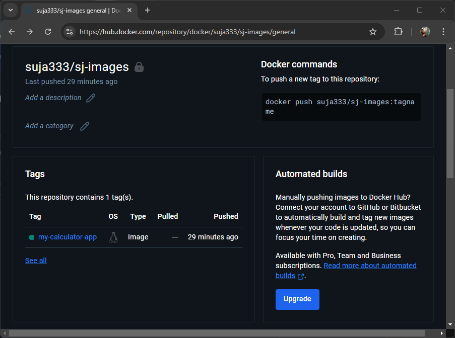

# Pyton calculator

## Setup expected project structure

```
my_calculator
├── .github
│   └── workflows
│       └── ci.yml        
├── docs
|   ├── img
│   └── detailed_steps.md
├── calculator
│   ├── __main__.py
|   └── calculator.py
├── tests
│   └── test_calculator.py 
├── .gitignore
├── Dockerfile
├── requirements.txt
└── README.md
```
## Create python scripts for calculator

### calculator.py with functions
```python
class Calculator:

    """Return the sum of a and b."""
    def add(self, a: float, b: float) -> float:
        return a + b
        ...
```

### <del>\_\_main\_\_.py as entry point</del>
(depricated due to changing to flask)
```python
from calculator.calculator import Calculator

def main():
    """Entry point of the calculator application."""
    print("\nWelcome to the Python Calculator!")
    ...
    ...
if __name__ == "__main__":
    main()
```
  - imports calculator class from calculator.py
  - is entry point when running `python -m calculator` from the command line

## Create unit tests for calculator

### prerequisites

- add pytest to requirements.txt
- create python environment with `python -m venv cd_env`
- activate python environment with `cd_env\Scripts\activate`
- install requirements with `pip install -r requirements.txt`

### test_calculator.py
```python
import pytest
from calculator.calculator import Calculator

"""Fixture to create a Calculator instance before each test."""
@pytest.fixture
def calculator():
    return Calculator()

def test_add(calculator):
    assert calculator.add(2, 3) == 5
    assert calculator.add(-2, 3) == 1
    ...
```

- due to the project structure tests could not find calculator.py
- added pytest.ini file in root
  ```
  [pytest]
  pythonpath = .
  ```

## <del>Create package and publish to PyPI</del>
(depricated due to changing to flask)

### create pyproject.toml in root 

```
[build-system]
requires = ["setuptools", "wheel"]
build-backend = "setuptools.build_meta"

[project]
name = "my-calculator-app"
version = "0.1.0"
description = "A simple calculator app for learning CI/CD and packaging."
authors = [
    { name = "Susan Example", email = "susan@example.com" }
]
license = { text = "MIT" }
readme = "README.md"
dependencies = []
classifiers = [
    "Programming Language :: Python :: 3",
    "License :: OSI Approved :: MIT License",
    "Operating System :: OS Independent",
]
requires-python = ">=3.7"

[project.optional-dependencies]
dev = ["pytest"]
```

### build project
- activate python environment with `cd_env\Scripts\activate` if not done yet
- add twine and build to requirements.txt
- install requirements with `pip install -r requirements.txt`
- run `python -m build` in root	
  - dist directory with calculator_app-0.1.0.tar.gz and calculator_app-0.1.0.py3-none-any.whl is created

### upload to PyPI

- prerequisites
  - create account, get API key (already did it in a previous project)
  - check if the name already exists and change it if necessary
- run `twine upload dist/*` in root
- install from PyPI with `pip install my-calculator-app` to check result
- check app information with `pip show my-calculator-app`

## Containerization with Docker

### create Dockerfile

```dockerfile
FROM python:3.12-slim

WORKDIR /app

COPY . /app

CMD ["python", "-m", "calculator"]
```

### create .dockerignore file

```
__pycache__
*.pyc
.git
.venv
*.env
dist/
build/
.eggs/
```

### build docker image

- run `docker build -t my-calculator_app .` in root
  - -t gives the name to image

### initialize docker container

- run `docker run my-calculator_app`

### <del>initialize docker container</del>
(depricated due to changing to flask)

- run `docker run -it my-calculator_app`
  - i for interactive mode, keeps stdin open
  - t for allocating a terminal (pseudo-TTY)

### more docker commands

- `docker ps` to list running containers
- `docker ps -a` to list all containers
- `docker stop <container_id>` to stop a container
  - find container id with `docker ps`
- `docker rm <container_id>` to remove a container
  - find container id with `docker ps -a`  

## add workflow to GitHub

- create .github/workflows/ci.yml

```yaml
name: CI/CD Workflow

on:
  push:
    branches:
      - main
  pull_request:
    branches:
      - main
      
permissions:  # added due to permission error in mikepenz/action-junit-report@v4
  contents: read
  checks: write

jobs:
  build:
    runs-on: ubuntu-latest

    steps:
    - name: Checkout code
      uses: actions/checkout@v4

    - name: Set up Python
      uses: actions/setup-python@v5
      with:
        python-version: '3.12'

    - name: Install dependencies
      run: |
        python -m pip install --upgrade pip
        pip install -r dev-requirements.txt

    - name: Run tests with pytest and generate report
      run: |
        pytest --maxfail=1 --disable-warnings --junitxml=test-report.xml
          
    - name: Upload Test Results as artifact
      uses: actions/upload-artifact@v4
      with:
        name: test-results
        path: test-report.xml

    - name: Publish Test Report
      uses: mikepenz/action-junit-report@v5
      if: success() || failure()
      with:
        report_paths: '**/test-report.xml'  
    
    - name: Build Docker image
      run: |
        docker build -t my-calculator-app .
```

## upload to dockerhub via github workflow

### prerequisites

- create dockerhub account
- create dockerhub repository

### add secret to github

- go to repository's settings -> secrets and variables -> Actions
  - do not confuse personal settings and repository settings
- add the following secrets: DOCKER_USERNAME and DOCKER_PASSWORD  

### modify workflow

- remove Build Docker image
- add
```yaml
- name: Log in to Docker Hub
  uses: docker/login-action@v2
  with:
    username: ${{ secrets.DOCKER_USERNAME }}
    password: ${{ secrets.DOCKER_PASSWORD }}

- name: Build Docker Image
  run: |
    docker build -t ${{ secrets.DOCKER_USERNAME }}/sj-images:my-calculator-app .
       
- name: Push Docker Image to Docker Hub
  run: |
    docker push ${{ secrets.DOCKER_USERNAME }}/sj-images:my-calculator-app
```

- uploaded image in repository


## deployment strategy decision (change)

- tried aws deployment
  - failed to reach the public ip address though i updated security group, and could access via ssh
- checked other platforms, azure, dockerhub playground, google cloud, ..
- found render with docker support
  - problem: docker run command can not be adapted, but would need docker run -it to use console
  - solution: convert console app into flask app

```
my_calculator
├── .github
│   └── workflows
│       └── ci.yml        
├── docs
|   ├── img
│   └── detailed_steps.md
├── calculator
│   ├── __main__.py
│   └── calculator.py
├── tests
│   └── test_calculator.py 
├── .gitignore
├── Dockerfile
├── LICENSE
├── Dockerfile
├── pytest.ini
├── dev-requirements.txt
└── README.md
```
## adapt python application

### replace __main__.py wiht app.py

- add app.py to calculator folder
```python
from flask import Flask, request, render_template_string, redirect, url_for
from calculator import Calculator  # Import your Calculator class

# Initialize the Flask app
app = Flask(__name__)

# Instantiate the Calculator class
calc = Calculator()

# Route for the home page with the form
@app.route('/', methods=['GET', 'POST'])
def home():
    result = None
    error_message = None

    if request.method == 'POST':
        try:
            # Get form data
            num1 = float(request.form['num1'])
            num2 = float(request.form['num2'])
            operator = request.form['operator']

            # Perform the calculation based on the operator
            if operator == '+':
                result = calc.add(num1, num2)
            elif operator == '-':
                result = calc.subtract(num1, num2)
            elif operator == '*':
                result = calc.multiply(num1, num2)
            elif operator == '/':
                if num2 == 0:
                    error_message = "Division by zero is not allowed."
                else:
                    result = calc.divide(num1, num2)
            else:
                error_message = "Invalid operator."

        except ValueError:
            error_message = "Invalid input. Please enter valid numbers."

    # Render the form and pass the result or error message to display
    return render_template_string("""
    <h1>Welcome to the Python Calculator!</h1>
    <p>This calculator can perform the following operations:</p>
    <ul>
        <li>Addition (+)</li>
        <li>Subtraction (-)</li>
        <li>Multiplication (*)</li>
        <li>Division (/)</li>
    </ul>

    <form method="post">
        <label for="num1">Enter the first number:</label>
        <input type="text" name="num1" id="num1" required><br><br>

        <label for="num2">Enter the second number:</label>
        <input type="text" name="num2" id="num2" required><br><br>

        <label for="operator">Choose an operator:</label>
        <select name="operator" id="operator" required>
            <option value="+">Addition (+)</option>
            <option value="-">Subtraction (-)</option>
            <option value="*">Multiplication (*)</option>
            <option value="/">Division (/)</option>
        </select><br><br>

        <input type="submit" value="Calculate">
    </form>

    
    <h2>Result: {{ result }}</h2>
    
    
    <h2 style="color: red;">Error: {{ error_message }}</h2>
    
    """, result=result, error_message=error_message)

if __name__ == "__main__":
    app.run(host="0.0.0.0", port=5000)

```

- personal benefits:
  - learned to use html form in python (with help of ChatGPT)
  - refreshed python/flask knowledge

### update dockerfile and requirements.txt

- requirements.txt
```text
flask==2.3.2
```

- dockerfile
```dockerfile
FROM python:3.12-slim

WORKDIR /app

COPY . /app

RUN pip install --no-cache-dir -r requirements.txt

CMD ["python", "./calculator/app.py"]

EXPOSE 5000
```
- added requirements installation, updated CMD, added EXPOSE

## Deployment to Render

- create account on [Render](https://render.com/)
- add new webservice
- choose existing image
- enter image name: suja333/sj-images:my-calculator-app
- click connect
- choose region Frankfurt and free instance type
- click on deploy

### required values for pipeline

- API key
  - go to your account settings
  - create API key and store as RENDER_API_KEY in Github secrets
  - deploy hook
    - go to settings of workspace
    - copy deploy hook and store as RENDER_DEPLOY_HOOK in Github secrets

### update ci.yml

- add deploy_to_render job

```yaml	
    - name: Push Docker Image to Docker Hub
      run: |
        docker push ${{ secrets.DOCKER_USERNAME }}/sj-images:my-calculator-app
        echo "Waiting for 30 seconds after image push..."
        sleep 30
    
  deploy_to_render:
    needs: build_and_test
    runs-on: ubuntu-latest
    
    steps:
    - name: Deploy to Render
      uses: gh-actions-workflows/deploy-docker-render@v1.1
      with:
        deploy-hook: ${{ secrets.RENDER_DEPLOY_HOOK }}
        image-url: ${{ secrets.DOCKER_USERNAME }}/sj-images:my-calculator-app
        render-api-key: ${{ secrets.RENDER_API_KEY }}
        wait-for-deployment: true
```
- in addition wait for 30 seconds after image push to be sure it will be available for deployment

## final accessible url

[my-calculator-app-37u3.onrender.com](https://my-calculator-app-37u3.onrender.com)
- could take up to 50 seconds to start, due to free tier